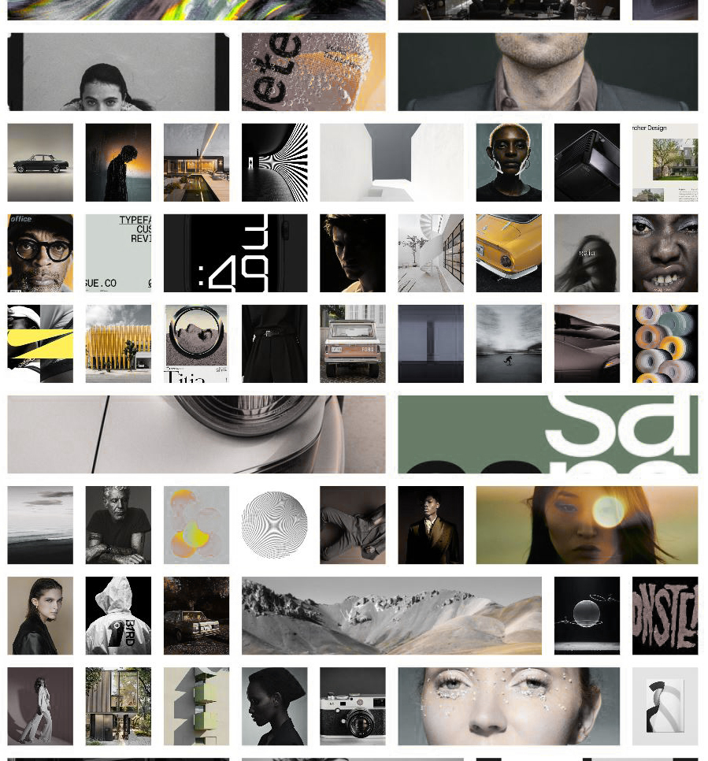

# FAQ

<br>

### How fast is it?
The library isn't trying to achieve many things at once,
instead focusing on one problem and solving it well.
As a result, **UHUGRID** is hardly doing any calculations. It is fast and snappy.

Tested against the native Masonry CSS and Masonry.js

<br>

### Is it responsive?
Behind the scenes, the library was implemented in a way
where breakpoints (media queries) were useless.
Thus making it more responsive to any device.

It scales up to 4K (beyond 4K the user has full control over the settings)

<br>

### Does it keep my HTML markup order?
Yes, the item's order will always stay the same as your HTML markup,
the library isn't relying on `grid-auto-flow: dense` or `flexbox`.

<br>

### Does it work for everything?
No layout will, it depends on your design requirements.
**UHUGRID** is perfect if you don't have too much text to fit in each card
or if you have a gallery of images. 

<br>

### Can I save a generated layout?
No, if you find yourself wanting to lock on a specific generated layout.
That means you content isn't dynamic. maybe instead just use pure CSS.

<br>

### Can I use `grid-gap`?



This library is fast because it is not trying to do many things,
rather focusing and perfecting one main design.

The main idea was to glue all grid items together not letting any
free space in between. However it is understandable to desire
spacing columns and rows apart.

#### Gaps between rows
You can easily insert gaps between rows using `row-gap`

```css
.gallery {
  row-gap: 1rem;
}
```

#### Gaps between columns
As explained in the [how to](#how-to) video, gaps between columns
can be baked inside the library. However they are a bit of a hack
and they demand more calculation.
It is not worth it if the solution has a 1% chance of failure

A better solution is to use something that looks like a gap,
we can use `Border` while `box-sizing` is set to `border-box`.

*PS*: If you are going to use border as a gap, it is better
to use it all over the item, not just `border-right`
and `border-left`.

If you look closely to the image above, there's a small aspect
ratio mismatch, because we are using border for column gaps
and `row-gap` for row gaps.

Better use use border alone for perfect aesthetic results.

<br>

> The border solution was demonstrated in the video

<br>

### how much content can I fit inside `.gallery__item`?
**UHUGRID** works best with images and `divs` that contain little
content or content that can be cropped.

The nature of the library is to randomly choose different sizes
that will fit together. So it is possible in the near future
to add an option to force bigger sizes for bigger content.

<br>

> The cropping solution was demonstrated in the video

<br>

### Does UHUGRID listens to screen re size events?
Yes it does, and it is not expensive on the user's CPU.
In real world scenarios, the event will fire 2 to 5 times max.
