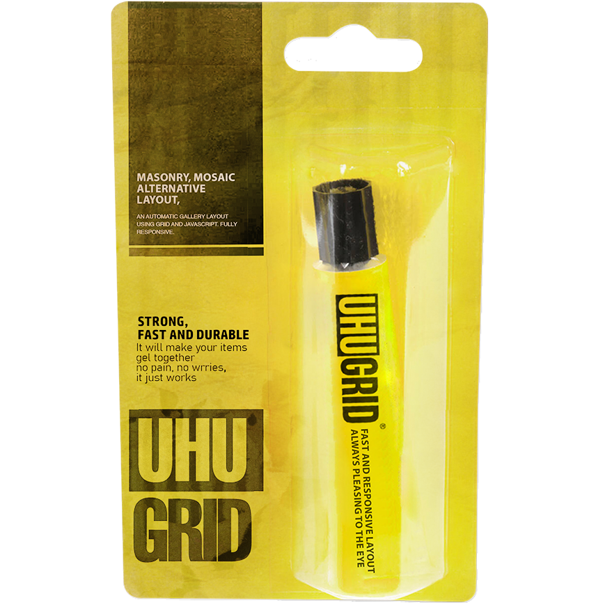

<br>


# UHU GRID

Named *UHU* because of its default behavior. *Glue all items together
and don't waste any free space.*
Every time you refresh the page or request a layout change,
a new layout will be generated even if the screen size stays the same.

It works as a best alternative if

+ Each card contains little to no inner content
+ The number of cards are dynamic, unknown or might change in the future
+ You want the layout to be future-proof, so you'll never worry about code maintenance.

<br>

Because of the above limitations, cards are not bound by their content dimensions.
That's why it can **generate visually appealing cards**
by using aspect ratios suited best for the current screen size and
the available free space.
Unlike other solutions where the dimension of each card is determined by its content,
**UHUGRID** has the luxury to generate sizes that look good and fit best.

Something that Masonry can't do.

<br>

**To read more about speed comparison against native Masonry or other libraries
read [FAQ](./FAQ.md).**
  
<br>

# Live demo
[Click here](https://cipherlogs.github.io/uhugrid/demo/)
to access a simple live example of **UHUGRID**.

<br>

# How to
Watch this walkthrough to understand some basics that might save you time.

[Watch on YouTube](https://youtu.be/PT3ZhB4-Y40)

<br>

# Install

### 1. CDN
Just inject it in you HTML markup and the rest will be taken care of!

```HTML
<script
  defer
  src = "https://cdn.jsdelivr.net/npm/uhugrid@1.0.1/plug.min.js"

>
</script>
```

<br>

### 2. NPM

```
$ npm install --save-dev uhugrid
```

```JavaScript
import {uhu} from "uhugrid";
```


<br>

# Usage
`.gallery` for the parent container
and `.gallery__item` for all its children.


```HTML
<div class="gallery">

  <div class="gallery__item">
    <!-- PLACE WHEREVER YOU WANT IN HERE -->
  </div>

</div>
```

The plugin only comes with the basic styling that are needed for
it to function properly. It is up to you to style `.gallery__item`
and its content the way you want.

Overriding `.gallery` and `.gallery__item` is the correct way
the library was intended to be used.
Please watch the [**How to**](#how-to) video, to understand
some important details before you override any styles.


<br>

# API

The `uhu()` method controls the column size and the maximum height
for each row.


```JavaScript
uhu();
// everthing will be taken care of by default

uhu(1, 1);
// all grid items will have the same height
// items width are always different and can't be controlled

uhu(0, 2)
// column width will be calculated according to the viewport width
//
// The row height is a range from 1 to 2
// it could be 100px height or 200px height
//
// items width as always will be generated randomly to
// aesthetically match the row height
```

#### Syntax

> glue (column_size, maximum_row_height)


#### Paramaters

+ column_size **optional**: a range from 1 to 40,
  1 is approximately `100px`. If you insert `0` or `undefined`,
  **UHUGRID** will choose the best column size depending on
  the display width of the user.
  By default it can scale up to 4K displays.

+ maximum_row_height **optional**: for example if you insert 3,
  **UHUGRID** will randomly generate rows that are
  `100px`, `200px`, `300px` in height.
  If you insert 1, all rows will stay at `100px` height.
  `0` or `undefined` to let **UHUGRID** choose the most
  aesthetic height range related to column size.
  

<br>

# FAQ
Visit [FAQ.md](./FAQ.md) to read common questions and design
decisions.

<br>

# Changes

+ for upcoming changes take a look at the **Issues** tab.
+ visit [CHANGELOG.md](./CHANGELOG.md) for more information about
  each release.

<br>

# License
**UHUGRID** is released under the GPL-3.0 license.

